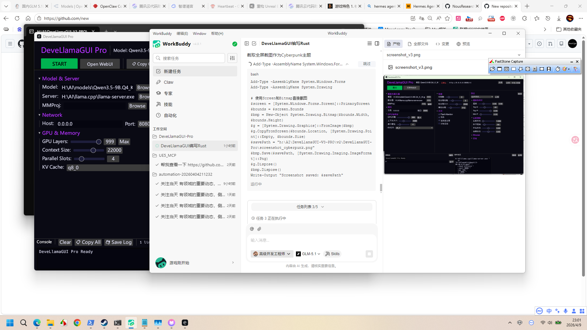
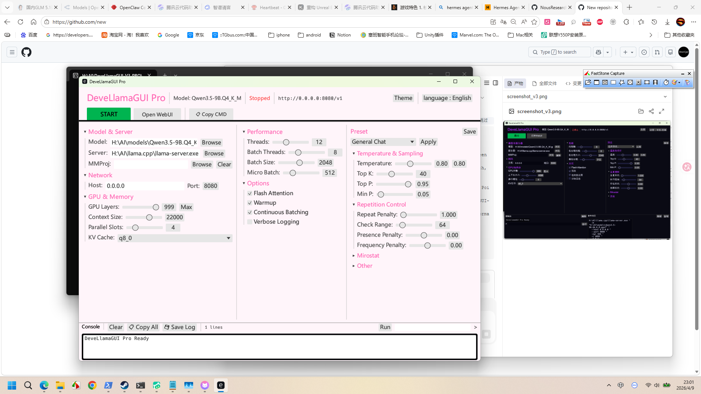

<a id="简体中文"></a>

# 🦙 DeveLlamaGUI Pro

**一个轻量级的 [llama.cpp](https://github.com/ggerganov/llama.cpp) 服务器原生GUI——用 Rust 编写。**

[](LICENSE)
[](#)
[](#)

<p align="center">
  
  
</p>

<p align="center"><em>Cyberpunk（默认）& Sakura Pink 主题</em></p>

## 🌐 Languages / 语言

[简体中文](#简体中文) | [English](#english) | [繁體中文](#繁體中文) | [日本語](#日本語) | [한국어](#한국어)

---

## 为什么选择 DeveLlamaGUI Pro？

用 `llama.cpp` 运行本地大模型很强大，但命令行界面太麻烦了——你得记住几十个参数，输入长命令，而且无法在运行时调整参数。

第三方GUI如 LM Studio 自带引擎，导致**巨大的下载量（几个GB）**和**高内存占用（1GB+）**。

**DeveLlamaGUI Pro** 采用了不同的方式：它只是一个 ~3MB 的外壳，直接调用你自己的 `llama-server.exe`，零捆绑，零冗余。

### 📊 对比一览

| | DeveLlamaGUI Pro | LM Studio | llama.cpp CLI |
|---|---|---|---|
| **容量** | ~3 MB | ~2 GB+ | ~50 MB |
| **GUI 内存占用** | ~35 MB* | ~1 GB+ | N/A |
| **图形界面** | ✅ 原生 | ✅ Electron | ❌ 仅命令行 |
| **运行时调参** | ✅ | ❌ | ❌ |
| **预设管理** | ✅ 7种内置 | ✅ | ❌ |
| **思考模式开关** | ✅ | ✅ | ❌ |
| **使用自己的llama.cpp** | ✅ | ❌ (内置) | ✅ |

> \* GUI 程序本身仅占 ~35MB 内存（llama-server 进程已运行后）。首次启动约 145MB（含CJK字体加载）。

### 💾 内存占用详情

```
内存占用 (Working Set)
━━━━━━━━━━━━━━━━━━━━━━━━━━━━━━━━━━━━━━━━━━━━━━━━━━━━━

首次启动      ████████████████████████████████████░░░░░░░░░░  ~145 MB
              (加载CJK字体 + OpenGL渲染上下文)

模型运行后    ████████████░░░░░░░░░░░░░░░░░░░░░░░░░░░░░░░░░░░  ~35 MB
              (字体已缓存, repaint频率降低, 系统回收空闲页)

对比 LM Studio  ████████████████████████████████████████████████████████████████████████████████  ~1 GB+
```

### 核心功能

- 🚀 **启动和管理** llama-server，不再输入命令
- ⚡ **运行时调参** — 实时调整 temperature、top-k、top-p、repeat penalty
- 💾 **预设系统** — 7种内置预设 + 自定义保存/加载/删除
- 🧠 **思考模式开关** — 一键切换 On/Off/Auto，支持 Qwen3/3.5/DeepSeek 等推理模型
- 🖥️ **GPU 显存管理** — 自动检测 GPU VRAM，可视化显存占用（模型+KV缓存），Auto GPU Fit
- 🔍 **自动验证** — 启动后自动检测 ctx_size 是否匹配，状态栏实时显示
- 🌍 **5种语言** — English, 简体中文, 繁體中文, 日本語, 한국어
- 🎨 **6种主题** — Cyberpunk、Sakura Pink、Minimal Light、Ocean Blue、Midnight、Forest Green
- 📋 **控制台** — 实时日志查看，支持一键复制和导出文件
- 🖥️ **原生性能** — Rust + egui + OpenGL 渲染，极低资源占用
- ⚙️ **全参数支持** — GPU层数/分配、上下文大小、KV缓存(K/V独立)、批处理、Flash Attention、RoPE、LoRA、内存管理等

### 内置预设

| 预设 | Temperature | Top-K | Top-P | Min-P | Repeat Penalty |
|------|-------------|-------|-------|-------|----------------|
| General Chat | 0.7 | 40 | 0.9 | 0.05 | 1.1 |
| **Code Mode** | **0.6** | **20** | **1.0** | **0.0** | **1.05** |
| Creative Writing | 0.9 | 100 | 0.95 | 0.05 | 1.1 |
| OpenClaw | 0.6 | 40 | 0.9 | 0.05 | 1.1 |
| Roleplay | 0.8 | 100 | 0.95 | 0.05 | 1.1 |
| Math & Logic | 0.3 | 10 | 0.8 | 0.0 | 1.0 |
| Brainstorm | 1.0 | 100 | 0.95 | 0.05 | 1.15 |

## 快速开始

1. **下载** 最新版 [Releases](https://github.com/deveuper/DeveLlamaGUI-Pro/releases)
2. **放置** `DeveLlamaGUI-Pro.exe` 到任意位置
3. **配置** `llama-server.exe` 路径和 GGUF 模型文件路径
4. **点击 Start** — 就这么简单！

### 系统要求

- Windows 10/11 x64
- [llama.cpp](https://github.com/ggerganov/llama.cpp)（只需 `llama-server.exe`）
- GGUF 模型文件
- NVIDIA GPU（可选，用于GPU加速）

## 配置

所有设置自动保存到 `%APPDATA%/DeveLlamaGUI/config.json`，下次启动自动恢复。

### 支持的参数

| 参数 | 命令行标志 | 说明 |
|------|-----------|------|
| 模型路径 | `--model` | GGUF 模型文件路径 |
| 主机 | `--host` | 服务器地址（默认: 127.0.0.1） |
| 端口 | `--port` | 服务器端口（默认: 8080） |
| GPU层数 | `--n-gpu-layers` | 卸载到GPU的层数（999=全部） |
| 上下文大小 | `--ctx-size` | 提示上下文大小 |
| 线程数 | `--threads` | 线程数量 |
| 批处理大小 | `--batch-size` | 逻辑批大小 |
| 微批大小 | `--ubatch-size` | 物理批大小 |
| Flash Attention | `--flash-attn` | 启用Flash Attention |
| K缓存类型 | `--cache-type-k` | K缓存量化格式（f16/f32/q8_0等） |
| V缓存类型 | `--cache-type-v` | V缓存量化格式（可独立于K缓存设置） |
| 并行槽位 | `--parallel` | 并行序列数 |
| 连续批处理 | `--no-cont-batching` | 禁用连续批处理 |
| 思考模式 | `--reasoning` | on/off/auto（支持 Qwen3/3.5、DeepSeek 等） |
| GPU分割模式 | `--split-mode` | 多GPU分割（none/layer/row） |
| 张量分割 | `--tensor-split` | 多GPU比例（如 "3,1"） |
| 主GPU | `--main-gpu` | 主GPU索引 |
| CPU MoE | `--cpu-moe` | MoE权重留在CPU |
| Auto GPU Fit | `--fit` | 自动根据VRAM调整GPU层数和ctx |
| RoPE缩放 | `--rope-scaling` | 位置编码缩放（none/linear/yarn） |
| 内存锁定 | `--mlock` | 锁定内存防swap |
| LoRA适配器 | `--lora` / `--lora-scaled` | LoRA微调模型路径 |
| API密钥 | `--api-key` | HTTP API认证密钥 |

## 从源码构建

```bash
git clone https://github.com/deveuper/DeveLlamaGUI-Pro.git
cd DeveLlamaGUI-Pro
cargo build --release
```

优化后的二进制文件在 `target/release/DeveLlamaGUI-Pro.exe`。

## 技术栈

- **Rust** — 内存安全，极速
- **egui / eframe** — 即时模式GUI框架
- **glow (OpenGL)** — 轻量GPU渲染后端
- **rfd** — 原生文件对话框

## 许可证

MIT License — 自由使用、修改和分发。

---

<a id="english"></a>

## 🇬🇧 English

**A lightweight, native GUI for [llama.cpp](https://github.com/ggerganov/llama.cpp) server — written in Rust.**

Running local LLMs with `llama.cpp` is powerful, but the command-line interface is cumbersome — you have to memorize dozens of flags, type long commands, and there's no way to adjust parameters at runtime.

Third-party GUIs like LM Studio bundle their own engine, resulting in **massive downloads (several GB)** and **high memory usage (1GB+)**.

**DeveLlamaGUI Pro** takes a different approach: it's just a ~3MB shell that calls your own `llama-server.exe`. Zero bundling, zero bloat.

### 📊 Comparison

| | DeveLlamaGUI Pro | LM Studio | llama.cpp CLI |
|---|---|---|---|
| **Size** | ~3 MB | ~2 GB+ | ~50 MB |
| **GUI Memory** | ~35 MB* | ~1 GB+ | N/A |
| **GUI** | ✅ Native | ✅ Electron | ❌ CLI only |
| **Runtime tuning** | ✅ | ❌ | ❌ |
| **Preset management** | ✅ 7 built-in | ✅ | ❌ |
| **Thinking mode toggle** | ✅ | ✅ | ❌ |
| **Uses your llama.cpp** | ✅ | ❌ (bundled) | ✅ |

> \* The GUI itself uses only ~35MB of memory (after llama-server is running). First launch is ~145MB (CJK font loading + OpenGL context).

### 💾 Memory Usage

```
Memory (Working Set)
━━━━━━━━━━━━━━━━━━━━━━━━━━━━━━━━━━━━━━━━━━━━━━━━━━━━━

First launch    ████████████████████████████████████░░░░░░░░░░  ~145 MB
                (CJK fonts + OpenGL render context)

After model     ████████████░░░░░░░░░░░░░░░░░░░░░░░░░░░░░░░░░░░  ~35 MB
is running      (fonts cached, lower repaint rate, OS reclaims pages)

LM Studio       ████████████████████████████████████████████████████████████████████████████████  ~1 GB+
```

### Key Features

- 🚀 **Launch & manage** llama-server with a clean GUI — no more typing commands
- ⚡ **Runtime parameter tuning** — adjust temperature, top-k, top-p, repeat penalty on the fly
- 💾 **Preset system** — 7 built-in presets + custom save/load/delete
- 🧠 **Thinking mode toggle** — one-click On/Off/Auto, supports Qwen3/3.5, DeepSeek and other reasoning models
- 🖥️ **GPU VRAM management** — auto-detect GPU VRAM, visualize memory usage (model + KV cache), Auto GPU Fit
- 🔍 **Auto verification** — ctx_size check after server start, real-time status bar
- 🌍 **5 languages** — English, 简体中文, 繁體中文, 日本語, 한국어
- 🎨 **6 themes** — Cyberpunk, Sakura Pink, Minimal Light, Ocean Blue, Midnight, Forest Green
- 📋 **Console** — real-time log viewer with copy-all and export-to-file
- 🖥️ **Native performance** — Rust + egui + OpenGL rendering, minimal resource usage
- ⚙️ **Full parameter support** — GPU layers/allocation, context size, KV cache (independent K/V), batching, Flash Attention, RoPE, LoRA, memory management, and more

### Built-in Presets

| Preset | Temperature | Top-K | Top-P | Min-P | Repeat Penalty |
|--------|-------------|-------|-------|-------|----------------|
| General Chat | 0.7 | 40 | 0.9 | 0.05 | 1.1 |
| **Code Mode** | **0.6** | **20** | **1.0** | **0.0** | **1.05** |
| Creative Writing | 0.9 | 100 | 0.95 | 0.05 | 1.1 |
| OpenClaw | 0.6 | 40 | 0.9 | 0.05 | 1.1 |
| Roleplay | 0.8 | 100 | 0.95 | 0.05 | 1.1 |
| Math & Logic | 0.3 | 10 | 0.8 | 0.0 | 1.0 |
| Brainstorm | 1.0 | 100 | 0.95 | 0.05 | 1.15 |

## Configuration

All settings are automatically saved to `%APPDATA%/DeveLlamaGUI/config.json` and restored on next launch.

### Supported Parameters

| Parameter | CLI Flag | Description |
|-----------|----------|-------------|
| Model path | `--model` | Path to GGUF model file |
| Host | `--host` | Server address (default: 127.0.0.1) |
| Port | `--port` | Server port (default: 8080) |
| GPU layers | `--n-gpu-layers` | Layers to offload to GPU (999=all) |
| Context size | `--ctx-size` | Prompt context size |
| Threads | `--threads` | Number of threads |
| Batch size | `--batch-size` | Logical batch size |
| Micro batch | `--ubatch-size` | Physical batch size |
| Flash Attention | `--flash-attn` | Enable Flash Attention |
| K cache type | `--cache-type-k` | K cache quantization (f16/f32/q8_0 etc.) |
| V cache type | `--cache-type-v` | V cache quantization (independent from K) |
| Parallel slots | `--parallel` | Number of parallel sequences |
| Continuous batching | `--no-cont-batching` | Disable continuous batching |
| Thinking mode | `--reasoning` | on/off/auto (supports Qwen3/3.5, DeepSeek, etc.) |
| GPU split mode | `--split-mode` | Multi-GPU split (none/layer/row) |
| Tensor split | `--tensor-split` | Multi-GPU ratio (e.g. "3,1") |
| Main GPU | `--main-gpu` | Primary GPU index |
| CPU MoE | `--cpu-moe` | Keep MoE weights on CPU |
| Auto GPU Fit | `--fit` | Auto-adjust GPU layers & ctx to fit VRAM |
| RoPE scaling | `--rope-scaling` | Position encoding scaling (none/linear/yarn) |
| Memory lock | `--mlock` | Lock memory to prevent swap |
| LoRA adapter | `--lora` / `--lora-scaled` | Path to LoRA fine-tuned model |
| API key | `--api-key` | HTTP API authentication key |

## Quick Start

1. **Download** the latest release from [Releases](https://github.com/deveuper/DeveLlamaGUI-Pro/releases)
2. **Place** `DeveLlamaGUI-Pro.exe` anywhere on your system
3. **Configure** the path to your `llama-server.exe` and GGUF model file
4. **Click Start** — that's it!

### Requirements

- Windows 10/11 x64
- [llama.cpp](https://github.com/ggerganov/llama.cpp) (just the `llama-server.exe` binary)
- A GGUF model file
- NVIDIA GPU (optional, for GPU acceleration)

## Build from Source

```bash
git clone https://github.com/deveuper/DeveLlamaGUI-Pro.git
cd DeveLlamaGUI-Pro
cargo build --release
```

The optimized binary will be at `target/release/DeveLlamaGUI-Pro.exe`.

## Tech Stack

- **Rust** — Memory-safe, blazing fast
- **egui / eframe** — Immediate-mode GUI framework
- **glow (OpenGL)** — Lightweight GPU rendering backend
- **rfd** — Native file dialogs

## License

MIT License — feel free to use, modify, and distribute.

---

<a id="繁體中文"></a>

## 🇹🇼 繁體中文

**一個輕量級的 [llama.cpp](https://github.com/ggerganov/llama.cpp) 伺服器原生GUI——用 Rust 編寫。**

用 `llama.cpp` 運行本地大模型很強大，但命令列介面太麻煩了——你得記住幾十個參數，輸入長命令，而且無法在運行時調整參數。

第三方GUI如 LM Studio 自帶引擎，導致**巨大的下載量（幾個GB）**和**高記憶體佔用（1GB+）**。

**DeveLlamaGUI Pro** 採用了不同的方式：它只是一個 ~3MB 的外殼，直接呼叫你自己的 `llama-server.exe`，零捆綁，零冗餘。

### 📊 對比一覽

| | DeveLlamaGUI Pro | LM Studio | llama.cpp CLI |
|---|---|---|---|
| **容量** | ~3 MB | ~2 GB+ | ~50 MB |
| **GUI 記憶體佔用** | ~35 MB* | ~1 GB+ | N/A |
| **圖形介面** | ✅ 原生 | ✅ Electron | ❌ 僅命令列 |
| **運行時調參** | ✅ | ❌ | ❌ |
| **預設管理** | ✅ 7種內建 | ✅ | ❌ |
| **思考模式開關** | ✅ | ✅ | ❌ |
| **使用自己的llama.cpp** | ✅ | ❌ (內建) | ✅ |

> \* GUI 程式本身僅佔 ~35MB 記憶體（llama-server 程序已運行後）。首次啟動約 145MB（含CJK字型載入）。

### 💾 記憶體佔用詳情

```
記憶體佔用 (Working Set)
━━━━━━━━━━━━━━━━━━━━━━━━━━━━━━━━━━━━━━━━━━━━━━━━━━━━━

首次啟動      ████████████████████████████████████░░░░░░░░░░  ~145 MB
              (載入CJK字型 + OpenGL渲染上下文)

模型運行後    ████████████░░░░░░░░░░░░░░░░░░░░░░░░░░░░░░░░░░░  ~35 MB
              (字型已快取, repaint頻率降低, 系統回收閒置頁)

對比 LM Studio  ████████████████████████████████████████████████████████████████████████████████  ~1 GB+
```

### 核心功能

- 🚀 **啟動和管理** llama-server，不再輸入命令
- ⚡ **運行時調參** — 即時調整 temperature、top-k、top-p、repeat penalty
- 💾 **預設系統** — 7種內建預設 + 自訂儲存/載入/刪除
- 🧠 **思考模式開關** — 一鍵切換 開啟/關閉/自動，支援 Qwen3/3.5、DeepSeek 等推理模型
- 🖥️ **GPU 顯存管理** — 自動偵測 GPU VRAM，視覺化顯存佔用（模型+KV快取），Auto GPU Fit
- 🔍 **自動驗證** — 啟動後自動檢測 ctx_size 是否匹配，狀態列即時顯示
- 🌍 **5種語言** — English, 簡體中文, 繁體中文, 日本語, 한국어
- 🎨 **6種主題** — Cyberpunk、Sakura Pink、Minimal Light、Ocean Blue、Midnight、Forest Green
- 📋 **控制台** — 即時日誌查看，支援一鍵複製和匯出檔案
- 🖥️ **原生效能** — Rust + egui + OpenGL 渲染，極低資源佔用
- ⚙️ **全參數支援** — GPU層數/分配、上下文大小、KV快取(K/V獨立)、批次處理、Flash Attention、RoPE、LoRA、記憶體管理等

### 內建預設

| 預設 | Temperature | Top-K | Top-P | Min-P | Repeat Penalty |
|------|-------------|-------|-------|-------|----------------|
| General Chat | 0.7 | 40 | 0.9 | 0.05 | 1.1 |
| **Code Mode** | **0.6** | **20** | **1.0** | **0.0** | **1.05** |
| Creative Writing | 0.9 | 100 | 0.95 | 0.05 | 1.1 |
| OpenClaw | 0.6 | 40 | 0.9 | 0.05 | 1.1 |
| Roleplay | 0.8 | 100 | 0.95 | 0.05 | 1.1 |
| Math & Logic | 0.3 | 10 | 0.8 | 0.0 | 1.0 |
| Brainstorm | 1.0 | 100 | 0.95 | 0.05 | 1.15 |

## 快速開始

1. **下載** 最新版 [Releases](https://github.com/deveuper/DeveLlamaGUI-Pro/releases)
2. **放置** `DeveLlamaGUI-Pro.exe` 到任意位置
3. **設定** `llama-server.exe` 路徑和 GGUF 模型檔案路徑
4. **點擊 Start** — 就這麼簡單！

### 系統需求

- Windows 10/11 x64
- [llama.cpp](https://github.com/ggerganov/llama.cpp)（只需 `llama-server.exe`）
- GGUF 模型檔案
- NVIDIA GPU（可選，用於GPU加速）

## 設定

所有設定自動儲存到 `%APPDATA%/DeveLlamaGUI/config.json`，下次啟動自動恢復。

### 支援的參數

| 參數 | 命令列標誌 | 說明 |
|------|-----------|------|
| 模型路徑 | `--model` | GGUF 模型檔案路徑 |
| 主機 | `--host` | 伺服器位址（預設: 127.0.0.1） |
| 連接埠 | `--port` | 伺服器連接埠（預設: 8080） |
| GPU層數 | `--n-gpu-layers` | 卸載到GPU的層數（999=全部） |
| 上下文大小 | `--ctx-size` | 提示上下文大小 |
| 執行緒數 | `--threads` | 執行緒數量 |
| 批次大小 | `--batch-size` | 邏輯批次大小 |
| 微批次大小 | `--ubatch-size` | 物理批次大小 |
| Flash Attention | `--flash-attn` | 啟用 Flash Attention |
| K快取類型 | `--cache-type-k` | K快取量化格式（f16/f32/q8_0等） |
| V快取類型 | `--cache-type-v` | V快取量化格式（可獨立於K快取設定） |
| 平行槽位 | `--parallel` | 平行序列數 |
| 連續批次處理 | `--no-cont-batching` | 停用連續批次處理 |
| 思考模式 | `--reasoning` | 開啟/關閉/自動（支援 Qwen3/3.5、DeepSeek 等） |
| GPU分割模式 | `--split-mode` | 多GPU分割（none/layer/row） |
| 張量分割 | `--tensor-split` | 多GPU比例（如 "3,1"） |
| 主GPU | `--main-gpu` | 主GPU索引 |
| CPU MoE | `--cpu-moe` | MoE權重留在CPU |
| Auto GPU Fit | `--fit` | 自動根據VRAM調整GPU層數和ctx |
| RoPE縮放 | `--rope-scaling` | 位置編碼縮放（none/linear/yarn） |
| 記憶體鎖定 | `--mlock` | 鎖定記憶體防swap |
| LoRA適配器 | `--lora` / `--lora-scaled` | LoRA微調模型路徑 |
| API金鑰 | `--api-key` | HTTP API認證金鑰 |

## 從原始碼建構

```bash
git clone https://github.com/deveuper/DeveLlamaGUI-Pro.git
cd DeveLlamaGUI-Pro
cargo build --release
```

最佳化後的二進位檔案在 `target/release/DeveLlamaGUI-Pro.exe`。

## 技術堆疊

- **Rust** — 記憶體安全，極速
- **egui / eframe** — 即時模式GUI框架
- **glow (OpenGL)** — 輕量GPU渲染後端
- **rfd** — 原生檔案對話框

## 授權

MIT License — 自由使用、修改和分發。

---

<a id="日本語"></a>

## 🇯🇵 日本語

**[llama.cpp](https://github.com/ggerganov/llama.cpp) サーバーのための軽量ネイティブGUI — Rustで作成。**

`llama.cpp`でローカルLLMを実行するのは強力ですが、コマンドラインインターフェースは面倒です — 数十のフラグを覚え、長いコマンドを入力し、実行時にパラメータを調整できません。

LM StudioなどのサードパーティGUIは独自のエンジンを同梱しており、**巨大なダウンロード（数GB）**と**高いメモリ使用量（1GB+）**をもたらします。

**DeveLlamaGUI Pro**は別のアプローチを取ります：~3MBのシェルだけで、自分の`llama-server.exe`を呼び出します。バンドルなし、無駄なし。

### 📊 比較一覧

| | DeveLlamaGUI Pro | LM Studio | llama.cpp CLI |
|---|---|---|---|
| **サイズ** | ~3 MB | ~2 GB+ | ~50 MB |
| **GUI メモリ** | ~35 MB* | ~1 GB+ | N/A |
| **GUI** | ✅ ネイティブ | ✅ Electron | ❌ CLIのみ |
| **ランタイム調整** | ✅ | ❌ | ❌ |
| **プリセット管理** | ✅ 7種内蔵 | ✅ | ❌ |
| **思考モード切替** | ✅ | ✅ | ❌ |
| **独自のllama.cpp使用** | ✅ | ❌ (バンドル) | ✅ |

> \* GUI自体は~35MBのメモリのみ使用（llama-server起動後）。初回起動時は~145MB（CJKフォント読み込み + OpenGLコンテキスト）。

### 💾 メモリ使用量の詳細

```
メモリ使用量 (Working Set)
━━━━━━━━━━━━━━━━━━━━━━━━━━━━━━━━━━━━━━━━━━━━━━━━━━━━━

初回起動        ████████████████████████████████████░░░░░░░░░░  ~145 MB
                (CJKフォント + OpenGLレンダーコンテキスト)

モデル実行後    ████████████░░░░░░░░░░░░░░░░░░░░░░░░░░░░░░░░░░░  ~35 MB
                (フォントキャッシュ、低repaint頻度、OSがページを回収)

LM Studio       ████████████████████████████████████████████████████████████████████████████████  ~1 GB+
```

### 主な機能

- 🚀 **起動と管理** — llama-serverをGUIで操作、コマンド入力不要
- ⚡ **ランタイムパラメータ調整** — temperature、top-k、top-p、repeat penaltyをリアルタイムで変更
- 💾 **プリセットシステム** — 7種類の内蔵プリセット + カスタム保存/読み込み/削除
- 🧠 **思考モード切替** — ワンクリックでオン/オフ/自動、Qwen3/3.5、DeepSeekなどの推論モデルに対応
- 🖥️ **GPU VRAM管理** — GPU VRAM自動検出、メモリ使用量の可視化（モデル+KVキャッシュ）、Auto GPU Fit
- 🔍 **自動検証** — サーバー起動後にctx_sizeの一致を自動確認、ステータスバーにリアルタイム表示
- 🌍 **5言語対応** — English, 简体中文, 繁體中文, 日本語, 한국어
- 🎨 **6テーマ** — Cyberpunk、Sakura Pink、Minimal Light、Ocean Blue、Midnight、Forest Green
- 📋 **コンソール** — リアルタイムログ表示、全コピー＆ファイルエクスポート対応
- 🖥️ **ネイティブパフォーマンス** — Rust + egui + OpenGL、最小リソース使用
- ⚙️ **全パラメータ対応** — GPUレイヤー/割り当て、コンテキストサイズ、KVキャッシュ(K/V独立)、バッチ処理、Flash Attention、RoPE、LoRA、メモリ管理など

### 内蔵プリセット

| プリセット | Temperature | Top-K | Top-P | Min-P | Repeat Penalty |
|-----------|-------------|-------|-------|-------|----------------|
| General Chat | 0.7 | 40 | 0.9 | 0.05 | 1.1 |
| **Code Mode** | **0.6** | **20** | **1.0** | **0.0** | **1.05** |
| Creative Writing | 0.9 | 100 | 0.95 | 0.05 | 1.1 |
| OpenClaw | 0.6 | 40 | 0.9 | 0.05 | 1.1 |
| Roleplay | 0.8 | 100 | 0.95 | 0.05 | 1.1 |
| Math & Logic | 0.3 | 10 | 0.8 | 0.0 | 1.0 |
| Brainstorm | 1.0 | 100 | 0.95 | 0.05 | 1.15 |

## クイックスタート

1. **ダウンロード** 最新版 [Releases](https://github.com/deveuper/DeveLlamaGUI-Pro/releases)
2. **配置** `DeveLlamaGUI-Pro.exe` を任意の場所に
3. **設定** `llama-server.exe` のパスとGGUFモデルファイルのパスを指定
4. **Start をクリック** — これだけです！

### 動作環境

- Windows 10/11 x64
- [llama.cpp](https://github.com/ggerganov/llama.cpp)（`llama-server.exe`のみ必要）
- GGUFモデルファイル
- NVIDIA GPU（オプション、GPU高速化用）

## 設定

すべての設定は `%APPDATA%/DeveLlamaGUI/config.json` に自動保存され、次回起動時に復元されます。

### 対応パラメータ

| パラメータ | CLIフラグ | 説明 |
|-----------|----------|------|
| モデルパス | `--model` | GGUFモデルファイルのパス |
| ホスト | `--host` | サーバーアドレス（デフォルト: 127.0.0.1） |
| ポート | `--port` | サーバーポート（デフォルト: 8080） |
| GPUレイヤー | `--n-gpu-layers` | GPUにオフロードするレイヤー数（999=全て） |
| コンテキストサイズ | `--ctx-size` | プロンプトコンテキストサイズ |
| スレッド数 | `--threads` | スレッド数 |
| バッチサイズ | `--batch-size` | 論理バッチサイズ |
| マイクロバッチ | `--ubatch-size` | 物理バッチサイズ |
| Flash Attention | `--flash-attn` | Flash Attentionを有効化 |
| Kキャッシュタイプ | `--cache-type-k` | Kキャッシュ量子化（f16/f32/q8_0等） |
| Vキャッシュタイプ | `--cache-type-v` | Vキャッシュ量子化（Kとは独立に設定可能） |
| パラレルスロット | `--parallel` | 並列シーケンス数 |
| 連続バッチ処理 | `--no-cont-batching` | 連続バッチ処理を無効化 |
| 思考モード | `--reasoning` | オン/オフ/自動（Qwen3/3.5、DeepSeekなどに対応） |
| GPU分割モード | `--split-mode` | マルチGPU分割（none/layer/row） |
| テンソル分割 | `--tensor-split` | マルチGPU比率（例: "3,1"） |
| メインGPU | `--main-gpu` | プライマリGPUインデックス |
| CPU MoE | `--cpu-moe` | MoEウェイトをCPUに保持 |
| Auto GPU Fit | `--fit` | VRAMに合わせてGPUレイヤーとctxを自動調整 |
| RoPEスケーリング | `--rope-scaling` | 位置エンコーディングスケーリング（none/linear/yarn） |
| メモリロック | `--mlock` | メモリをロックしてスワップ防止 |
| LoRAアダプター | `--lora` / `--lora-scaled` | LoRAファインチューニングモデルのパス |
| APIキー | `--api-key` | HTTP API認証キー |

## ソースからビルド

```bash
git clone https://github.com/deveuper/DeveLlamaGUI-Pro.git
cd DeveLlamaGUI-Pro
cargo build --release
```

最適化されたバイナリは `target/release/DeveLlamaGUI-Pro.exe` にあります。

## 技術スタック

- **Rust** — メモリ安全、超高速
- **egui / eframe** — イミディエイトモードGUIフレームワーク
- **glow (OpenGL)** — 軽量GPUレンダリングバックエンド
- **rfd** — ネイティブファイルダイアログ

## ライセンス

MIT License — 自由に使用、改変、配布できます。

---

<a id="한국어"></a>

## 🇰🇷 한국어

**[llama.cpp](https://github.com/ggerganov/llama.cpp) 서버를 위한 가벼운 네이티브 GUI — Rust로 작성됨.**

`llama.cpp`로 로컬 LLM을 실행하는 것은 강력하지만, 명령줄 인터페이스는 번거롭습니다 — 수십 개의 플래그를 외우고, 긴 명령을 입력해야 하며, 런타임에 매개변수를 조정할 수 없습니다.

LM Studio 같은 서드파티 GUI는 자체 엔진을 번들로 제공하여 **거대한 다운로드(수 GB)**와 **높은 메모리 사용량(1GB+)**을 초래합니다.

**DeveLlamaGUI Pro**는 다른 접근 방식을 취합니다: ~3MB 셸로 자신의 `llama-server.exe`를 호출합니다. 번들링 없이, 낭비 없이.

### 📊 비교 한눈에 보기

| | DeveLlamaGUI Pro | LM Studio | llama.cpp CLI |
|---|---|---|---|
| **크기** | ~3 MB | ~2 GB+ | ~50 MB |
| **GUI 메모리** | ~35 MB* | ~1 GB+ | N/A |
| **GUI** | ✅ 네이티브 | ✅ Electron | ❌ CLI만 |
| **런타임 조정** | ✅ | ❌ | ❌ |
| **프리셋 관리** | ✅ 7개 내장 | ✅ | ❌ |
| **사고 모드 전환** | ✅ | ✅ | ❌ |
| **자체 llama.cpp 사용** | ✅ | ❌ (번들) | ✅ |

> \* GUI 자체는 ~35MB 메모리만 사용 (llama-server 실행 후). 첫 실행 시 ~145MB (CJK 폰트 로딩 + OpenGL 컨텍스트).

### 💾 메모리 사용량 상세

```
메모리 사용량 (Working Set)
━━━━━━━━━━━━━━━━━━━━━━━━━━━━━━━━━━━━━━━━━━━━━━━━━━━━━

첫 실행        ████████████████████████████████████░░░░░░░░░░  ~145 MB
               (CJK 폰트 + OpenGL 렌더 컨텍스트)

모델 실행 후   ████████████░░░░░░░░░░░░░░░░░░░░░░░░░░░░░░░░░░░  ~35 MB
               (폰트 캐시됨, 낮은 repaint 빈도, OS가 페이지 회수)

LM Studio      ████████████████████████████████████████████████████████████████████████████████  ~1 GB+
```

### 주요 기능

- 🚀 **시작 및 관리** — GUI로 llama-server 조작, 명령어 입력 불필요
- ⚡ **런타임 매개변수 조정** — temperature, top-k, top-p, repeat penalty 실시간 변경
- 💾 **프리셋 시스템** — 7개 내장 프리셋 + 커스텀 저장/로드/삭제
- 🧠 **사고 모드 전환** — 원클릭 켜기/끄기/자동, Qwen3/3.5, DeepSeek 등 추론 모델 지원
- 🖥️ **GPU VRAM 관리** — GPU VRAM 자동 감지, 메모리 사용량 시각화(모델+KV 캐시), Auto GPU Fit
- 🔍 **자동 검증** — 서버 시작 후 ctx_size 일치 여부 자동 확인, 상태바 실시간 표시
- 🌍 **5개 언어** — English, 简体中文, 繁體中文, 日本語, 한국어
- 🎨 **6개 테마** — Cyberpunk, Sakura Pink, Minimal Light, Ocean Blue, Midnight, Forest Green
- 📋 **콘솔** — 실시간 로그 보기, 전체 복사 및 파일 내보내기 지원
- 🖥️ **네이티브 성능** — Rust + egui + OpenGL, 최소 리소스 사용
- ⚙️ **전체 매개변수 지원** — GPU 레이어/할당, 컨텍스트 크기, KV 캐시(K/V 독립), 배치 처리, Flash Attention, RoPE, LoRA, 메모리 관리 등

### 내장 프리셋

| 프리셋 | Temperature | Top-K | Top-P | Min-P | Repeat Penalty |
|-------|-------------|-------|-------|-------|----------------|
| General Chat | 0.7 | 40 | 0.9 | 0.05 | 1.1 |
| **Code Mode** | **0.6** | **20** | **1.0** | **0.0** | **1.05** |
| Creative Writing | 0.9 | 100 | 0.95 | 0.05 | 1.1 |
| OpenClaw | 0.6 | 40 | 0.9 | 0.05 | 1.1 |
| Roleplay | 0.8 | 100 | 0.95 | 0.05 | 1.1 |
| Math & Logic | 0.3 | 10 | 0.8 | 0.0 | 1.0 |
| Brainstorm | 1.0 | 100 | 0.95 | 0.05 | 1.15 |

## 빠른 시작

1. **다운로드** 최신 버전 [Releases](https://github.com/deveuper/DeveLlamaGUI-Pro/releases)
2. **배치** `DeveLlamaGUI-Pro.exe`를 원하는 위치에
3. **설정** `llama-server.exe` 경로와 GGUF 모델 파일 경로 지정
4. **Start 클릭** — 끝입니다!

### 시스템 요구사항

- Windows 10/11 x64
- [llama.cpp](https://github.com/ggerganov/llama.cpp) (`llama-server.exe`만 필요)
- GGUF 모델 파일
- NVIDIA GPU (선택, GPU 가속용)

## 설정

모든 설정은 `%APPDATA%/DeveLlamaGUI/config.json`에 자동 저장되며, 다음 실행 시 자동 복원됩니다.

### 지원 매개변수

| 매개변수 | CLI 플래그 | 설명 |
|---------|-----------|------|
| 모델 경로 | `--model` | GGUF 모델 파일 경로 |
| 호스트 | `--host` | 서버 주소 (기본값: 127.0.0.1) |
| 포트 | `--port` | 서버 포트 (기본값: 8080) |
| GPU 레이어 | `--n-gpu-layers` | GPU에 오프로드할 레이어 수 (999=전체) |
| 컨텍스트 크기 | `--ctx-size` | 프롬프트 컨텍스트 크기 |
| 스레드 수 | `--threads` | 스레드 수 |
| 배치 크기 | `--batch-size` | 논리 배치 크기 |
| 마이크로 배치 | `--ubatch-size` | 물리 배치 크기 |
| Flash Attention | `--flash-attn` | Flash Attention 활성화 |
| K 캐시 타입 | `--cache-type-k` | K 캐시 양자화 포맷 (f16/f32/q8_0 등) |
| V 캐시 타입 | `--cache-type-v` | V 캐시 양자화 포맷 (K 캐시와 독립 설정 가능) |
| 병렬 슬롯 | `--parallel` | 병렬 시퀀스 수 |
| 연속 배치 처리 | `--no-cont-batching` | 연속 배치 처리 비활성화 |
| 사고 모드 | `--reasoning` | 켜기/끄기/자동 (Qwen3/3.5, DeepSeek 등 지원) |
| GPU 분할 모드 | `--split-mode` | 다중 GPU 분할 (none/layer/row) |
| 텐서 분할 | `--tensor-split` | 다중 GPU 비율 (예: "3,1") |
| 메인 GPU | `--main-gpu` | 메인 GPU 인덱스 |
| CPU MoE | `--cpu-moe` | MoE 가중치를 CPU에 유지 |
| Auto GPU Fit | `--fit` | VRAM에 따라 GPU 레이어와 ctx 자동 조정 |
| RoPE 스케일링 | `--rope-scaling` | 위치 인코딩 스케일링 (none/linear/yarn) |
| 메모리 잠금 | `--mlock` | 메모리 잠금으로 스왑 방지 |
| LoRA 어댑터 | `--lora` / `--lora-scaled` | LoRA 미세조정 모델 경로 |
| API 키 | `--api-key` | HTTP API 인증 키 |

## 소스에서 빌드

```bash
git clone https://github.com/deveuper/DeveLlamaGUI-Pro.git
cd DeveLlamaGUI-Pro
cargo build --release
```

최적화된 바이너리는 `target/release/DeveLlamaGUI-Pro.exe`에 있습니다.

## 기술 스택

- **Rust** — 메모리 안전, 초고속
- **egui / eframe** — 이미디에이트 모드 GUI 프레임워크
- **glow (OpenGL)** — 경량 GPU 렌더링 백엔드
- **rfd** — 네이티브 파일 대화상자

## 라이선스

MIT License — 자유롭게 사용, 수정 및 배포 가능합니다.
